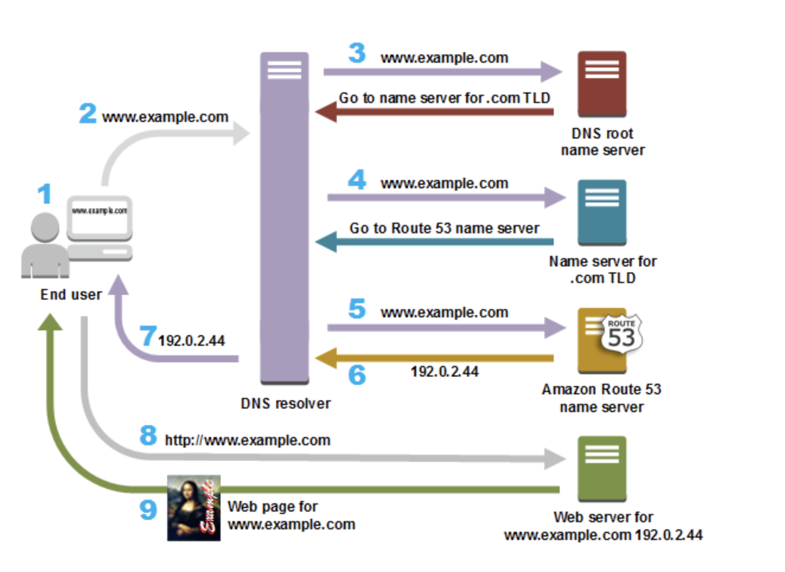

# Domain Name Server

## DNS 基本知識

網際網路上的所有電腦，從智慧型手機或筆記型電腦到為大量零售網站提供內容服務的伺服器，都是**使用數字**找到彼此並互相通訊。這些數字稱為 **IP 地址\(IP Address\)**。當您開啟 Web 瀏覽器進入網站時，不需要記住這些冗長的數字進行輸入，而是輸入像 www.example.com 這樣的**網域名稱\(Domain name\)** 就可以連接到正確的位置。

Amazon Route 53 這類的 DNS 服務是一種全球分佈的服務，它將 www.example.com 這種人們可讀取的名稱轉換為 192.0.2.1 等數字 IP 地址，供電腦用於互相連接。網際網路 DNS 系統的工作原理和電話簿類似，管理**「名稱」**和「**數字」**之間的對應關係。DNS 伺服器將名稱請求轉換為 IP 地址，以控制最終使用者在 Web 瀏覽器中輸入網域名稱時要連接的伺服器。這些請求稱為**查詢\(Query\)**。  

### Recap 重點整理: 

* Domain Name 網址名稱
* Internat Protocol 網址\(網路地址\) 
* Domain Name Server 處理 Domain &lt;=&gt; Ip 關係的伺服器

## DNS 如何將流量路由\(Route\) 到 Web 應用程式？

下圖概略說明遞迴和授權 DNS 服務如何搭配運作，將最終使用者路由到您的網站或應用程式。

1. 用戶在瀏覽器上輸入網址，按下「Enter」後；
2. www.example.com 發送請求路由至解析器\(DNS Resolver\) 
   * Resolver 拿著問題\( www.example.com 是誰?\) 詢問別人
3. ISP 的解析器將 www.example.com 的請求轉向至ROOT DNS\(根伺服器\)
4. 根伺服器說「我不知道」，並將請求轉至 .com 網域的其中一個 TLD 名稱伺服器
5. ISP 的 DNS 解析程式選擇一部 Amazon Route 53 名稱伺服器，並將 www.example.com 的請求轉送到該名稱伺服器。
6. Route 53 找到將 IP 地址傳回 DNS 解析程式。
7. ISP 的 DNS 解析程式最終取得使用者需要的 IP 地址。
8. DNS 解析程式也會將 example.com 的 IP 地址快取 \(存放\) 您所指定的一段時間，下次有人瀏覽到 example.com 時即可更快速的做出回應
9. Web 瀏覽器將 www.example.com 的請求傳送到從 DNS 解析程式取得的 IP 地址。
10. 顯示該網站頁面。

