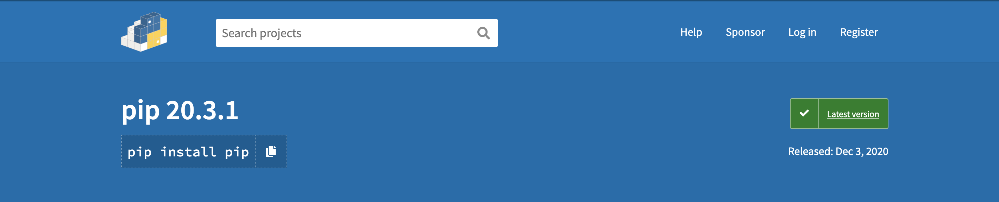

# PyPi upload

## ＊PYPI

> [**PyPI**](https://pypi.org/) \(Python Package Index\) 是一個軟體套件雲端儲存庫 \(Software Package Repository\)。

PyPI上面存有各社群或是個人發佈的 Python套件程式庫，就如同 Java 中的 [Maven ](https://maven.apache.org/)或是 JavaScript 的[ npm ](https://www.npmjs.com/)。

PyPI 上可以搜尋的各種套件，例如： Json / BeautifulSoup / Requests 等等。並且建議使用 `pip install` 這個 Python套件下載工具 \(Package Installer\) 下載需要的套件。


pip 為 Python 內建的下載工具 &lt;可以透過 `pip3 install --upgrade pip`來升級&gt;




## Pypi Upload

> 上傳 packages 至 PYPI 的步驟

* 創建 **PYPI** 帳號 \(可以使用 Github 帳號\)
* 建立 **PYPI** 上傳檔案架構 \(pypi tree\)
* 安裝需要的 Upload 套件 `pip twine`
* 上傳你自己的 Python packages 至 PYPI
* 上傳你自己的 Python packages 至 Github

### 一、創建 **PYPI** 帳號


### 二、建立 **PYPI** 上傳檔案架構


* 創建檔案

```text
@Using cmd to setup PYPI TREE

# 打開終端機
$ cd ~/workspace
$ mkdir mypackages
$ cd mypackages

# 開始創建檔案
$ touch LISCENSE README.md
$ touch setup.py setup.cfg
$ mkdir tests # Leave it empty is fine
```

* 建立 setup.py


```text
# 加入 configure to setup.py

import setuptools

setuptools.setup(
    name="Package Name",          # Replace with your package name
    version="0.0.1",              # Init 0.0.1
    author="username",            # Replace with your own username
    author_email="example@gmail.com",
    description="A small example package",
    url="https://github.com/example",
    packages=setuptools.find_packages(),
    classifiers=[
        "Programming Language :: Python :: 3",
        "License :: OSI Approved :: MIT License",
        "Operating System :: OS Independent",
    ],
    python_requires='>=3.6',       # Allow python version
)

```


* LISENSE.txt

```text
MIT License
Copyright (c) 2018 [YOUR NAME]
Permission is hereby granted, free of charge, to any person obtaining a copy
of this software and associated documentation files (the "Software"), to deal
in the Software without restriction, including without limitation the rights
to use, copy, modify, merge, publish, distribute, sublicense, and/or sell
copies of the Software, and to permit persons to whom the Software is
furnished to do so, subject to the following conditions:
The above copyright notice and this permission notice shall be included in all
copies or substantial portions of the Software.
THE SOFTWARE IS PROVIDED "AS IS", WITHOUT WARRANTY OF ANY KIND, EXPRESS OR
IMPLIED, INCLUDING BUT NOT LIMITED TO THE WARRANTIES OF MERCHANTABILITY,
FITNESS FOR A PARTICULAR PURPOSE AND NONINFRINGEMENT. IN NO EVENT SHALL THE
AUTHORS OR COPYRIGHT HOLDERS BE LIABLE FOR ANY CLAIM, DAMAGES OR OTHER
LIABILITY, WHETHER IN AN ACTION OF CONTRACT, TORT OR OTHERWISE, ARISING FROM,
OUT OF OR IN CONNECTION WITH THE SOFTWARE OR THE USE OR OTHER DEALINGS IN THE
SOFTWARE.
```

### 三、安裝上傳套件

> [twine](https://twine.readthedocs.io/en/latest/) 套件主要目的是為了更方便 上傳我們的 Packages 到 pypi 上。

```text
# Install twine
$ pip install twine

# Check if is install already
$ pip list 
```

### 四、上傳檔案到 PYPI

```text
# 將 package 檔案打包成 pypi 壓縮檔
$ python setup.py sdist
======================================
running check
creating python_addlist-0.0.1
creating python_addlist-0.0.1/python_addlist
creating python_addlist-0.0.1/python_addlist.egg-info
copying files to python_addlist-0.0.1...
copying setup.py -> python_addlist-0.0.1
copying python_addlist/__init__.py -> python_addlist-0.0.1/python_addlist
copying python_addlist.egg-info/PKG-INFO -> python_addlist-0.0.1/python_addlist.egg-info
copying python_addlist.egg-info/SOURCES.txt -> python_addlist-0.0.1/python_addlist.egg-info
copying python_addlist.egg-info/dependency_links.txt -> python_addlist-0.0.1/python_addlist.egg-info
copying python_addlist.egg-info/top_level.txt -> python_addlist-0.0.1/python_addlist.egg-info
Writing python_addlist-0.0.1/setup.cfg
creating dist
Creating tar archive
removing 'python_addlist-0.0.1' (and everything under it)
======================================

# 將 dist.tar.gz 壓縮檔上傳到 pypi
$ twine upload dist/*
======================================
Enter your username: 你的 pypi 帳號
Enter your password: 你的 pypi 密碼

Upload successfully !
======================================

```

### 五、上傳 Package 到 Github

> [https://github.com/joelbarmettlerUZH/Scrapeasy](https://github.com/joelbarmettlerUZH/Scrapeasy)

＊可以參考以上網站當作範例


